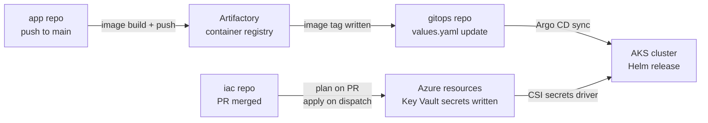

# Repo Topology

This platform is split across three repositories with strict ownership.
Use this document to figure out which repo owns a concern before you open
an issue or a PR.

---

## Repositories

| Repo | Kind | Owns |
|------|------|------|
| `risk_control_assessment_agentic_solution` | app | Fullstack backend, Azure UI, Node web services, Dockerfiles, unit & integration tests, image build CI, image push to Artifactory |
| `risk_control_assessment_agentic_solution_gitops` | gitops | Argo CD ApplicationSets, shared Helm charts (`charts/backend`, `charts/frontend`), per-env `values.yaml`, image-tag automation triggered by app CI |
| `risk_control_assessment_agentic_iac` | iac | Terraform for Azure resources (Key Vault, Postgres, Redis, Storage, Service Bus, Cognitive, Search, Databricks, Data Factory, Log Analytics, Synapse); per-env `config.auto.tfvars`; plan/apply/cluster-deploy workflows; Terraform CI; drift detection |

---

## Deployment Data Flow

---

## Contract Surface

Each repo relies on outputs from the others at runtime:

**iac → gitops / app:**
- Secret names written to Key Vault:
  `DB-HOST`, `DB-PASS`, `DB-DATABASE-URL`, `REDIS-HOST`, `REDIS-AAS-CONN-STRING`,
  `SERVICEBUS-NAME`, `SERVICEBUS-PRIMARY-KEY`, `STORAGE-CONNECTION-STRING`
- These names must not change without a coordinated PR across all three repos.

**gitops → iac:**
- Assumes Key Vault secrets exist before Argo CD syncs the app workload.
- The AKS cluster itself is provisioned by the platform team outside this repo.

**platform → iac:**
- `var.__ngc` schema (naming service, tags, subnets, resource groups) is
  injected at plan/apply time by Terraform Enterprise.
- Owned by the NGC platform team — do not mock or override in `.tf` files.

---

## Where to Open Issues

| Symptom | Repo |
|---------|------|
| `terraform plan` fails, module version mismatch, TFE ACL drift | `risk_control_assessment_agentic_iac` |
| Pod `CrashLoopBackOff` with Python / Node stack trace | `risk_control_assessment_agentic_solution` |
| Argo CD `OutOfSync`, wrong image tag deployed | `risk_control_assessment_agentic_solution_gitops` |
| Secret name in Key Vault differs from what the pod reads | File in `risk_control_assessment_agentic_iac` and cross-link to `risk_control_assessment_agentic_solution` |
| New Azure module request (e.g. add Event Hub) | `risk_control_assessment_agentic_iac` — use the "Feature / module request" issue template |
